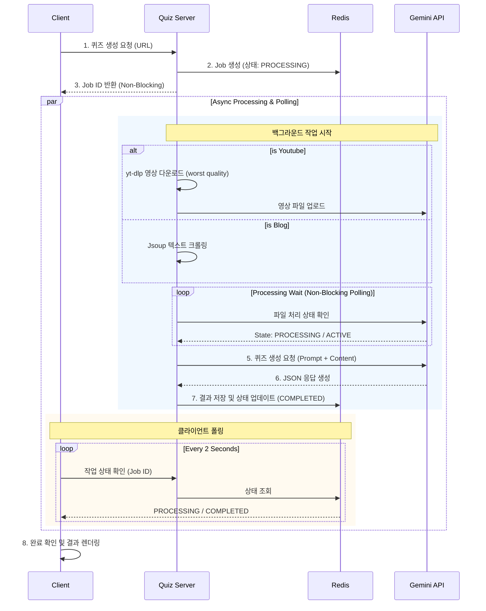

# 🧠 QuizAi - 나만의 AI 튜터

<p align="center">
  
</p>

> **URL 하나로 끝내는 맞춤형 학습.**  
> 기술 블로그, 유튜브 영상을 분석하여 핵심 퀴즈를 자동으로 생성해주는 AI 기반 학습 플랫폼입니다.

<br>

## 🛠 기술 스택

| Category | Tech Stack |
| :--- | :--- |
| **Language** | [](https://www.java.com/) |
| **Backend** | [](https://spring.io/projects/spring-boot) [](https://deepmind.google/technologies/gemini/) |
| **Frontend** | [](https://nextjs.org/) [](https://react.dev/) [](https://tailwindcss.com/) |
| **DB** | [](https://www.mysql.com/) [](https://redis.io/) |
| **Infra** | [](https://www.docker.com/) [](https://nginx.org/) [](https://github.com/features/actions) [](https://www.cloudflare.com/) |


<br>

## 🔗 Live Demo
👉 **[서비스 바로가기 (https://quizai.co.kr)](https://quizai.co.kr)**


<br>

## � 프로젝트 소개

**QuizAi**는 학습하고 싶은 **기술 블로그**나 **유튜브 영상**의 링크만 입력하면, **Google Gemini AI**가 내용을 정밀 분석하여 퀴즈를 생성해주는 서비스입니다.

단순한 요약을 넘어, 학습자가 내용을 제대로 이해했는지 검증할 수 있는 **문제 풀이 경험**을 제공하는 서비스입니다.

### 🎯 핵심 가치
- **시간 절약**: 긴 영상이나 글을 다 보지 않아도 핵심 내용을 퀴즈로 빠르게 파악.
- **능동적 학습**: 눈으로만 보는 것이 아니라 직접 문제를 풀며 학습.
- **접근성**: 별도의 회원가입 없이 URL 입력만으로 즉시 시작.

<br>

## 📸 서비스 프로세스

### 1. 퀴즈 요청
- URL과 문제 개수를 입력하여 퀴즈를 요청합니다.
<p align="center">
  
</p>

### 2. AI 분석 및 퀴즈 생성
Gemini AI가 콘텐츠를 분석하여 즉시 퀴즈를 생성합니다.
<p align="center">
  
</p>

### 3. 퀴즈 풀이
- 생성된 문제는 4지선다 형식으로 제공되며, 앞 문제를 풀어야 다음 문제로 넘어갈 수 있습니다.
<p align="center">
  
</p>

### 4. 결과 확인 및 해설
- 퀴즈를 모두 풀면 정답과 함께 해당 문제에 대한 해설을 확인할 수 있습니다.
<p align="center">
  
  
</p>

<br>

## � 기술 스택

### **Frontend**
| Name | Description |
| :--- | :--- |
| **Next.js 16** | App Router 기반의 서버 사이드 렌더링 및 최신 React 기능 활용 |
| **React 19** | 컴포넌트 기반 UI 개발 |
| **Tailwind CSS v4** | 유틸리티 퍼스트 CSS 프레임워크로 빠르고 일관된 스타일링 |

### **Backend**
| Name | Description |
| :--- | :--- |
| **Java 17 & Spring Boot 3.5** | 안정적이고 확장 가능한 백엔드 서버 구축 |
| **Spring Data JPA & Redis** | MySQL 영속성 관리 및 Redis 캐싱을 통한 성능 최적화 |
| **WebFlux (WebClient)** | Gemini API와의 비동기 논블로킹 통신 처리 |
| **Jsoup & yt-dlp** | 웹 크롤링 및 유튜브 비디오 오디오 추출 및 텍스트 변환 전처리 |

### **Infra & DevOps**
| Name | Description |
| :--- | :--- |
| **Docker & Compose** | 컨테이너 기반의 격리된 실행 환경 구성 |
| **Nginx** | 고정 Gateway 리버스 프록시 및 정적 파일 라우팅 |
| **Shell Scripting** | `deploy.sh`를 활용한 Frontend/Backend Blue/Green 무중단 배포 |

<br>

## 🧩 시스템 아키텍처

<p align="center">
  
</p>

<br>

## � 주요 기능

- **📝 멀티 모달 입력 지원**: 텍스트 기반의 **블로그 포스트**뿐만 아니라 **유튜브 영상** 링크까지 지원하여 다양한 형태의 학습 자료를 처리합니다.
- **⚡ 비동기 이벤트 처리**: `WebFlux`와 `Redis`를 활용한 비동기 작업 처리로 퀴즈 생성 중에도 사용자에게 실시간 진행 상황(대기 상태 등)을 안정적으로 피드백합니다.
- **🔄 무중단 배포**: 고정 Gateway 뒤에서 Frontend와 Backend를 독립적으로 전환하고 실패 시 upstream을 자동 복원하는 **Blue/Green 배포 전략**이 구현되어 있습니다.

<br>

## 📊 퀴즈 생성 플로우차트




## 🚀 시작하기

로컬 환경에서 프로젝트를 실행해보시려면 다음 단계를 따라주세요.

```bash
# 1. 저장소 클론
git clone https://github.com/your-repo/quizai.git

# 2. 프로젝트 이동
cd quizai

# 3. 환경 변수 설정
# 프로젝트 루트에 .env 파일을 생성하고 아래 형식을 참고하여 작성하세요.
# (GEMINI_API_KEY는 필수입니다)

DATABASE_NAME=quizAi
DATABASE_USERNAME=quizAi
DATABASE_PASSWORD=your_password
DATABASE_ROOT_PASSWORD=your_root_password

GEMINI_API_KEY=your_api_key_here

MYSQL_PORT=3306
REDIS_HOST=localhost
REDIS_PORT=6379

# 4. 개발 모드 실행
./dev.sh up
```

<br>

## 📝 회고
프로젝트 개발 과정에서의 기술적 고민과 해결 과정은 [RETROSPECTIVE.md](./RETROSPECTIVE.md)에서 확인하실 수 있습니다.

<br>

## 📨 Contact
- **Developer**: INSU
- **Email**: cth7097@naver.com
- **GitHub**: [github.com/CHOIIS829](https://github.com/CHOIIS829)


